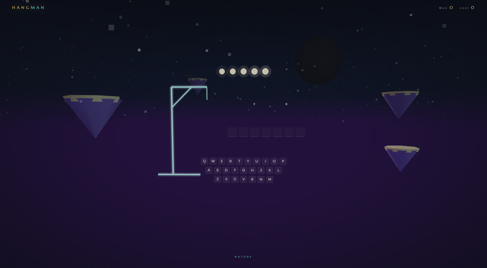

# 🌙 HANGMAN — Dreamed in Stars

> A fully immersive 3D Hangman game where **everything lives inside a Three.js world** — the gallows, the body parts, the keyboard, the letters. Nothing is flat UI sitting on top of a canvas. The game *is* the scene.

Built with the same emotion-first, cinematic design language as [Miraj](https://github.com/ahmadncheema/Miraj) and [Sohni Dharti](https://github.com/ahmadncheema/Sohni-Dharti). One single HTML file. No frameworks. No build step.

**[▶ Live Demo](https://ahmadncheema.github.io/Hangman/)**



---

## ✨ What Makes This Different

Most Hangman games are plain HTML buttons on a white page. This one puts you **inside a living world** and makes the game itself part of the environment.

| Element | How it exists in the world |
|---|---|
| **Gallows** | Glowing teal 3D pipe structure built from cylinders |
| **Body parts** | Orange/rose 3D spheres and cylinders that pop in with a scale animation |
| **Letter tiles** | Canvas-textured 3D planes floating in space, gold glow on reveal |
| **Keyboard** | 26 canvas-textured 3D panels in QWERTY rows — you click them in 3D space |
| **Lives** | 5 gold pulsing orbs that dim and die as you lose them |
| **Wrong guesses** | Letters spawn as 3D planes, drift upward, and fade into the sky |
| **Particle bursts** | Gold explosion on correct guess, rose explosion on wrong — with gravity |

---

## 🎮 How to Play

**Click** any letter tile in the 3D keyboard — or just **type on your physical keyboard**.

- You have **5 lives** (gold orbs at the top)
- Guess the word before all orbs go dark
- Press **H** for a hint — one per round, no penalty
- Win/Lose screen fades in over the world when the round ends

**35 words** across 7 categories, none obscure:

| Category | Examples |
|---|---|
| Technology | KEYBOARD, BROWSER, SERVER |
| Nature | GLACIER, MONSOON, VOLCANO |
| Space | NEBULA, ECLIPSE, COMET |
| Geography | ISLAMABAD, SKARDU, DUBAI |
| Life | COURAGE, FREEDOM, SILENCE |
| Architecture | MINARET, MOSQUE, DOME |
| General | JOURNEY, BALANCE, HORIZON |

Words don't repeat until the full pool is exhausted.

---

## 🌍 The Living World

The background is the same Three.js environment used across the trilogy:

- **5 floating islands** — bobbing and slowly rotating, visible behind the gallows
- **28 fireflies** — blinking warm gold and cool teal, rising endlessly
- **900 stars** in the upper atmosphere
- **Breathing moon** with triple halo layers
- **Mist particles** drifting across the scene
- **Gentle camera drift** following your mouse position
- **ACES filmic tone mapping** for the cinematic colour grade

---

## 🛠 Tech Stack

- [Three.js r128](https://threejs.org/) — 3D scene, custom geometry, raycasting, canvas textures
- Vanilla **HTML / CSS / JS** — zero dependencies beyond the Three.js CDN
- Google Fonts — *Marcellus* (display) + *Sora* (body)
- **Canvas API** — used to render letter tiles and keyboard keys as live textures inside Three.js

**One single `hangman.html` file — open and play.**

---

## 🚀 Run It

```bash
git clone https://github.com/ahmadncheema/Hangman.git
cd Hangman
# open hangman.html in any modern browser
```

Or serve locally:

```bash
npx serve .
```

**Enable GitHub Pages:** Settings → Pages → Source: `main`, root. Because the file is `index.html` (rename it), your demo URL becomes `https://ahmadncheema.github.io/Hangman/`.

> **Tip:** Rename `hangman.html` → `index.html` before pushing so GitHub Pages serves it at the clean root URL.

---

## ⚙️ Customise

Everything is in one file, clearly labelled:

| What | Where |
|---|---|
| Word list | `const WORDS = [...]` — add objects with `word`, `cat`, `hint` |
| Number of lives | `const MAX_LIVES = 5` |
| Gallows position | `const GALLOWS_X`, `GALLOWS_Y` |
| Island positions | `mkIsland(x, y, z, size)` calls |
| Colour palette | CSS `:root` variables + Three.js material colours |
| Camera behaviour | `camera.position` lines inside `tick()` |
| Tile layout | `tileSize`, `gap`, `baseY` in `buildKeyboard()` |

---

## ♿ Quality Floor

- Physical keyboard works throughout — type letters directly
- `prefers-reduced-motion` collapses all transitions
- Pixel ratio capped at 2× for mobile GPU
- Responsive down to mobile widths (keyboard tiles scale)

---

## 🇵🇰 The Trilogy

This game is the fourth project in the same creative engine:

| Project | Theme | Repo |
|---|---|---|
| **Miraj** | Surreal DeFi real estate · Dubai | [ahmadncheema/Miraj](https://github.com/ahmadncheema/Miraj) |
| **Sohni Dharti** | Pakistan tourism · Islamabad | [ahmadncheema/Sohni-Dharti](https://github.com/ahmadncheema/Sohni-Dharti) |
| **MFI-17 Mushshak** | Pakistan aviation heritage | [ahmadncheema/MFI-17-Mushshak](https://github.com/ahmadncheema/MFI-17-Mushshak) |
| **Hangman** | A game dreamed in stars | *this repo* |

---

## 📄 License

MIT — play free, dream wide. 🌙
